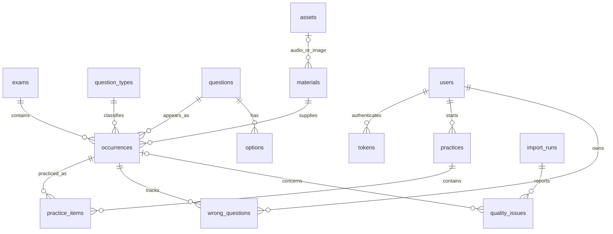

# Manabi 本机数据库表结构

从本机 PostgreSQL 实际读取，2026-09-15。数据库：manabi；服务端口：5433。

共 14 张业务表和 1 张迁移版本表。记录数包含历史版本及 retired 数据，不等同于当前可练习题数。

| 表 | 用途 | 当前记录数 |
|---|---|---:|
| `alembic_version` | 数据库迁移版本 | 1 |
| `assets` | 音频、图片路径及文件哈希 | 3,514 |
| `materials` | 阅读材料、翻译、字幕和资源引用 | 4,214 |
| `users` | 用户账号、等级和管理员标记 | 25 |
| `questions` | 题干及解析的内容版本 | 10,476 |
| `options` | 题目选项与正确答案 | 40,631 |
| `question_types` | 题型及词汇/语法/阅读/听力分类 | 21 |
| `practices` | 用户练习场次 | 57 |
| `tokens` | 登录凭证摘要与有效期 | 28 |
| `exams` | 试卷信息与来源元数据 | 103 |
| `occurrences` | 题目在具体试卷中的位置、题型和发布状态 | 16,798 |
| `practice_items` | 练习题目快照和作答记录 | 453 |
| `import_runs` | 导入批次和汇总报告 | 4 |
| `quality_issues` | 导入时发现的问题及历史记录 | 1,642 |
| `wrong_questions` | 用户错题及复习状态 | 55 |

## 主要关系

`questions` 保存内容版本，`occurrences` 保存试卷归属；同一内容可出现在多套试卷。`practice_items.snapshot` 保留出题时内容，后续导入不会改写已有练习快照。

以下列出数据库实际字段及约束。PK 为主键，FK 为外键；JSON 为结构化内容。

## alembic_version — 数据库迁移版本

| 字段 | 类型 | 可空 | 说明 / 数据库默认值 |
|---|---|---|---|
| `version_num` | `VARCHAR(32)` | 否 | PK |

## assets — 音频、图片路径及文件哈希

| 字段 | 类型 | 可空 | 说明 / 数据库默认值 |
|---|---|---|---|
| `id` | `VARCHAR(36)` | 否 | PK |
| `kind` | `VARCHAR(12)` | 否 | — |
| `path` | `TEXT` | 否 | — |
| `mime_type` | `VARCHAR(64)` | 否 | — |
| `byte_size` | `INTEGER` | 否 | — |
| `content_hash` | `VARCHAR(64)` | 是 | — |

唯一约束：`path`。

索引：`assets_path_key` (path)。

## materials — 阅读材料、翻译、字幕和资源引用

| 字段 | 类型 | 可空 | 说明 / 数据库默认值 |
|---|---|---|---|
| `id` | `VARCHAR(36)` | 否 | PK |
| `content` | `JSON` | 否 | — |
| `translation` | `JSON` | 否 | — |
| `subtitles` | `JSON` | 否 | — |
| `audio_id` | `VARCHAR(36)` | 是 | FK → assets.id |
| `image_id` | `VARCHAR(36)` | 是 | FK → assets.id |

## users — 用户账号、等级和管理员标记

| 字段 | 类型 | 可空 | 说明 / 数据库默认值 |
|---|---|---|---|
| `id` | `VARCHAR(36)` | 否 | PK |
| `username` | `VARCHAR(64)` | 是 | — |
| `password_hash` | `TEXT` | 是 | — |
| `level` | `VARCHAR(2)` | 否 | — |
| `created_at` | `TIMESTAMP` | 否 | — |
| `is_admin` | `BOOLEAN` | 否 | 默认：false |

唯一约束：`username`。

索引：`users_username_key` (username)。

## questions — 题干及解析的内容版本

| 字段 | 类型 | 可空 | 说明 / 数据库默认值 |
|---|---|---|---|
| `id` | `VARCHAR(36)` | 否 | PK |
| `content_hash` | `VARCHAR(64)` | 否 | — |
| `prompt` | `JSON` | 否 | — |
| `explanation` | `JSON` | 否 | — |

唯一约束：`content_hash`。

索引：`questions_content_hash_key` (content_hash)。

## options — 题目选项与正确答案

| 字段 | 类型 | 可空 | 说明 / 数据库默认值 |
|---|---|---|---|
| `id` | `VARCHAR(36)` | 否 | PK |
| `question_id` | `VARCHAR(36)` | 否 | FK → questions.id |
| `position` | `INTEGER` | 否 | — |
| `content` | `JSON` | 否 | — |
| `correct` | `BOOLEAN` | 否 | — |

唯一约束：`question_id, position`。

索引：`ix_options_question_id` (question_id)；`options_question_id_position_key` (question_id, position)。

## question_types — 题型及词汇/语法/阅读/听力分类

| 字段 | 类型 | 可空 | 说明 / 数据库默认值 |
|---|---|---|---|
| `id` | `VARCHAR(64)` | 否 | PK |
| `category` | `VARCHAR(24)` | 否 | — |
| `name_zh` | `VARCHAR(64)` | 否 | — |
| `name_ja` | `VARCHAR(64)` | 否 | — |
| `sort_order` | `INTEGER` | 否 | — |

索引：`ix_question_types_category` (category)。

## practices — 用户练习场次

| 字段 | 类型 | 可空 | 说明 / 数据库默认值 |
|---|---|---|---|
| `id` | `VARCHAR(36)` | 否 | PK |
| `user_id` | `VARCHAR(36)` | 否 | FK → users.id |
| `level` | `VARCHAR(2)` | 否 | — |
| `type_id` | `VARCHAR(64)` | 否 | FK → question_types.id |
| `mode` | `VARCHAR(16)` | 否 | — |
| `requested_count` | `INTEGER` | 否 | — |
| `status` | `VARCHAR(16)` | 否 | — |
| `created_at` | `TIMESTAMP` | 否 | — |
| `completed_at` | `TIMESTAMP` | 是 | — |
| `request_key` | `VARCHAR(64)` | 否 | — |

唯一约束：`user_id, request_key`。

索引：`ix_practices_user_id` (user_id)；`practices_user_id_request_key_key` (user_id, request_key)。

## tokens — 登录凭证摘要与有效期

| 字段 | 类型 | 可空 | 说明 / 数据库默认值 |
|---|---|---|---|
| `digest` | `VARCHAR(64)` | 否 | PK |
| `user_id` | `VARCHAR(36)` | 否 | FK → users.id |
| `expires_at` | `TIMESTAMP` | 否 | — |

索引：`ix_tokens_user_id` (user_id)。

## exams — 试卷信息与来源元数据

| 字段 | 类型 | 可空 | 说明 / 数据库默认值 |
|---|---|---|---|
| `id` | `VARCHAR(36)` | 否 | PK |
| `source_id` | `VARCHAR(64)` | 否 | — |
| `level` | `VARCHAR(2)` | 否 | — |
| `title` | `VARCHAR(128)` | 否 | — |
| `year` | `INTEGER` | 是 | — |
| `month` | `INTEGER` | 是 | — |
| `published` | `BOOLEAN` | 否 | — |
| `source_metadata` | `JSON` | 否 | — |

唯一约束：`level, source_id`。

索引：`exams_level_source_id_key` (level, source_id)；`ix_exams_level` (level)。

## occurrences — 题目在具体试卷中的位置、题型和发布状态

| 字段 | 类型 | 可空 | 说明 / 数据库默认值 |
|---|---|---|---|
| `id` | `VARCHAR(36)` | 否 | PK |
| `exam_id` | `VARCHAR(36)` | 否 | FK → exams.id |
| `question_id` | `VARCHAR(36)` | 否 | FK → questions.id |
| `material_id` | `VARCHAR(36)` | 否 | FK → materials.id |
| `type_id` | `VARCHAR(64)` | 是 | FK → question_types.id |
| `level` | `VARCHAR(2)` | 否 | — |
| `group_key` | `VARCHAR(36)` | 否 | — |
| `position` | `INTEGER` | 否 | — |
| `instruction` | `JSON` | 否 | — |
| `status` | `VARCHAR(16)` | 否 | — |
| `source` | `JSON` | 否 | — |
| `import_id` | `VARCHAR(36)` | 否 | — |

索引：`ix_occurrences_catalog` (level, type_id, status)；`ix_occurrences_exam_id` (exam_id)；`ix_occurrences_group_key` (group_key)；`ix_occurrences_import_id` (import_id)；`ix_occurrences_question_id` (question_id)。

## practice_items — 练习题目快照和作答记录

| 字段 | 类型 | 可空 | 说明 / 数据库默认值 |
|---|---|---|---|
| `id` | `VARCHAR(36)` | 否 | PK |
| `practice_id` | `VARCHAR(36)` | 否 | FK → practices.id |
| `occurrence_id` | `VARCHAR(36)` | 否 | FK → occurrences.id |
| `question_id` | `VARCHAR(36)` | 否 | FK → questions.id |
| `position` | `INTEGER` | 否 | — |
| `snapshot` | `JSON` | 否 | — |
| `chosen_option_id` | `VARCHAR(36)` | 是 | FK → options.id |
| `correct` | `BOOLEAN` | 是 | — |
| `answered_at` | `TIMESTAMP` | 是 | — |
| `elapsed_ms` | `INTEGER` | 是 | — |

唯一约束：`practice_id, occurrence_id`；`practice_id, position`。

索引：`ix_practice_items_practice_id` (practice_id)；`practice_items_practice_id_occurrence_id_key` (practice_id, occurrence_id)；`practice_items_practice_id_position_key` (practice_id, position)。

## import_runs — 导入批次和汇总报告

| 字段 | 类型 | 可空 | 说明 / 数据库默认值 |
|---|---|---|---|
| `id` | `VARCHAR(36)` | 否 | PK |
| `created_at` | `TIMESTAMP` | 否 | — |
| `summary` | `JSON` | 否 | — |

## quality_issues — 导入时发现的问题及历史记录

| 字段 | 类型 | 可空 | 说明 / 数据库默认值 |
|---|---|---|---|
| `id` | `VARCHAR(36)` | 否 | PK |
| `import_id` | `VARCHAR(36)` | 否 | FK → import_runs.id |
| `occurrence_id` | `VARCHAR(36)` | 是 | FK → occurrences.id |
| `code` | `VARCHAR(64)` | 否 | — |
| `severity` | `VARCHAR(16)` | 否 | — |
| `detail` | `JSON` | 否 | — |

索引：`ix_quality_issues_import_id` (import_id)。

## wrong_questions — 用户错题及复习状态

| 字段 | 类型 | 可空 | 说明 / 数据库默认值 |
|---|---|---|---|
| `user_id` | `VARCHAR(36)` | 否 | PK；FK → users.id |
| `occurrence_id` | `VARCHAR(36)` | 否 | PK；FK → occurrences.id |
| `wrong_count` | `INTEGER` | 否 | — |
| `resolved` | `BOOLEAN` | 否 | — |
| `updated_at` | `TIMESTAMP` | 否 | — |

注意：`occurrences.import_id` 是导入批次标识，但数据库未对其声明外键。字段的应用层默认值不一定是数据库默认值；以上以实际数据库为准。
